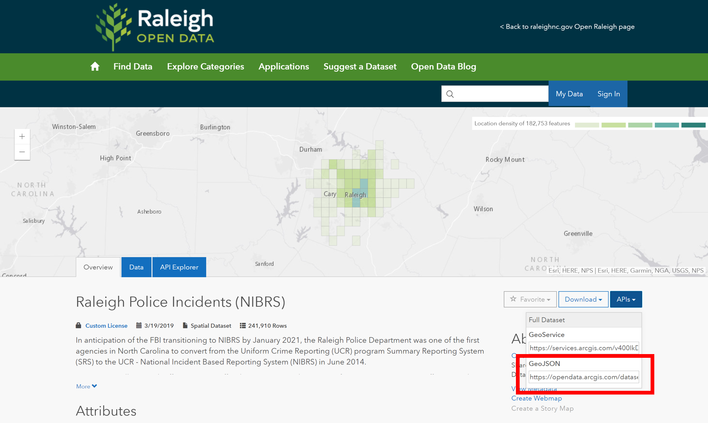
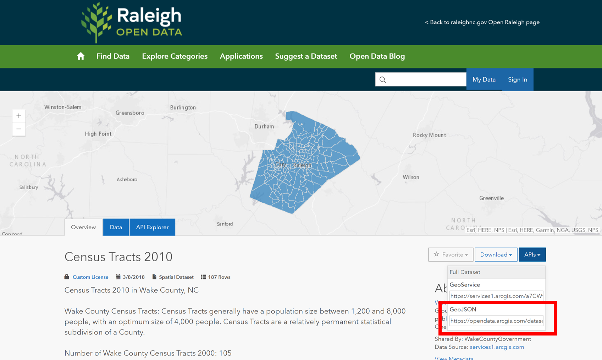
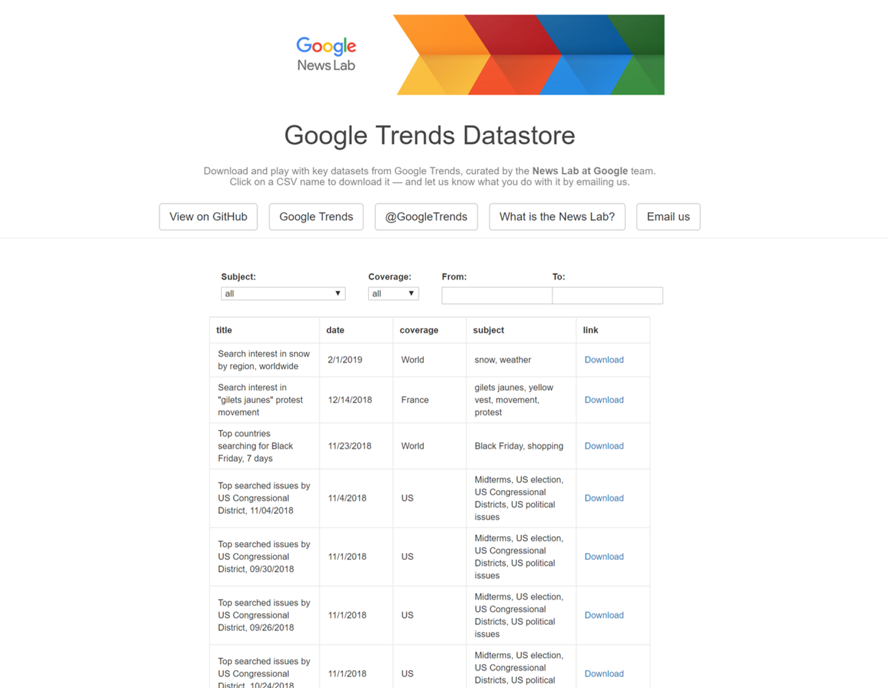

```{r setup, include=FALSE}
knitr::opts_chunk$set(echo = TRUE, message = FALSE, warning = FALSE)
```

Welcome to the wonderful world of R-Spatial! I really enjoy playing around with spatial data in R and for some reason find it much easier than ArcGIS (#sorrynotsorry Esri). Please keep in mind, as with everything I do in R, I am self taught and rely heavily on publicly available resources. My way of doing things may not always be the best or perfect, it is just how I was able to make sense of it.

One of the beautiful things about R is that there are many ways to get to your destination (in most cases). If you stumble across something in my code that is just wrong, could be way more efficient, and/or makes you cry into your cereal - please let me know! You definitely won't hurt my feelings. I just want to get better! 

In this post I am going to walk through some things that I have found myself doing regularly. A majority of the data I come across does not have a spatial component to it already or may not be associated with the particular geography that I need. Hopefully, I can demonstrate for you one approach to working through this in R.

The flow of this generally should be:

1. Pull down data with coordinates
2. Pull down polygon data
3. Verify overlap and matching projections
4. Combine points and polygons
5. Map aggressively
6. Huzzah!

# Load Packages
We will start by doing the obvious and loading our packages. You may notice me references some packages this way: ```cowplot::plot_grid()```. That just means that I opted not to load the entire package since I may only be using it one time. You may already know that but some of may not so just bear with me.

```{r}
library(sf)
library(tidyverse)
library(sp)
```


# Create Custom Theme
Here, I am quickly defining some thematic elements for my plots so I don't have to repeat them. I really need to get better about doing this!

```{r}
jason_theme <- theme(plot.title = element_text(size = 14),
        panel.background = element_blank(),
        axis.text = element_blank(),
        axis.title = element_blank(),
        axis.ticks = element_blank(),
        axis.line = element_blank())
```


# Download Police Incidents
I use the GeoJSON link on the [Raleigh Open Data Portal](https://data-ral.opendata.arcgis.com/) to download police incidents.



```{r}
police_incidents <- read_sf("https://opendata.arcgis.com/datasets/24c0b37fa9bb4e16ba8bcaa7e806c615_0.geojson")
```


# Filter Missing Coordinates
Quickly filter records that are missing coordinates.

```{r}
police_incidents <- police_incidents %>%
  filter(is.na(latitude) != TRUE)
```


# Test Plot
Let's just give it a try to make sure everything is working as intended. I am using base R here simply because it is faster.

```{r}
plot(police_incidents$geometry)
```


# Download Wake Census Tracts


```{r}
wake_tracts <- read_sf("https://opendata.arcgis.com/datasets/21d4ff44498a4007beefdcbde6fcd2a9_0.geojson")
```


# Test Plot
Another base R test plot just to be sure.

```{r}
plot(wake_tracts$geometry)
```


# Basic Density Plot
Great! Looks like everything is working as intended. Before I dive in to combining data, I want to show you a couple cool things you can do with these items in isolation.

## Create Tibble for Density Plotting
In this first step, I am using ```st_coordinates()``` to strip the coordinates out of my police incidents simple feature object. I am then storing those coordinates as a tibble that I can pass to my plot. This is a necessary step for the density plotting that I want to do.

```{r}
dens_dat <- police_incidents %>%
  st_coordinates() %>%
  as_tibble()
```


## Density Map
I have everything I need now to do a quick map of the density of police incident points. Notice I use ```..level..``` to access that statistic computed by the call to ```stat_density_2d```. You can read more about what is happening behind the scenes [here](https://stackoverflow.com/questions/32206623/what-does-level-mean-in-ggplotstat-density2d). Gotta love the R community!

```{r}
dens_dat %>%
  ggplot() +
  geom_sf(data = wake_tracts, color = "grey", fill = NA) +
  stat_density_2d(aes(X, Y, fill = ..level..), geom = "polygon", alpha = 0.6) +
  scale_fill_viridis_c("Density", option = "magma", direction = -1) +
  jason_theme
```


## Hexbin Map
Maybe that doesn't do it for you. Well strap yourself in for a hexbin map!

```{r}
dens_dat %>%
  ggplot() +
  geom_sf(data = wake_tracts, color = "grey", fill = NA) +
  geom_hex(aes(X, Y), alpha = 0.6) +
  scale_fill_viridis_c("Count", option = "magma", direction = -1) +
  jason_theme
```


# A Step Further
Those are a couple of quick maps you can generate with the data in isolation. Let's take it a step further and see what we can do if we combine the data.

## Convert to Spatial Objects
The first thing I need to do is convert both of my simple feature objects to ```Spatial*DataFrame```.

```{r}
police_spatial <- police_incidents %>%
  filter(latitude != 0) %>%
  as_Spatial()


wake_spatial <- wake_tracts %>%
  as_Spatial()
```


## Check Projections
Now I need to verify that my projections (Coordinated Reference Systems (CRS)) are matching.

```{r}
ral_crs <- proj4string(police_spatial)

wake_crs <- proj4string(wake_spatial)


print(ral_crs == wake_crs)
```


## Create Overlay
True means we are good to go! Now I can use ```over()``` to overlay my police incident points and Wake County census tracts. It will return the census tract attributes that are associated with each police incident record. After I perform the overlay, I am simply binding everything together.

```{r}
overlay <- over(police_spatial, wake_spatial) %>%
  select(GEOID10, NAMELSAD10) %>%
  cbind(police_spatial@data) %>%
  select(OBJECTID, GEOID10, NAMELSAD10)
```


## Join Data
Now to create a nice clean simple featur object, I join by the ```GEOID```. It is really helpful for you to learn more about these identifiers and how they are constructed if you want to play more with Census data. 

You can learn more about them here - [Understanding Geographic Identifiers (GEOIDs)](https://www.census.gov/geo/reference/geoidentifiers.html). You will see there how the identifiers are constructed from large to small components. If you are wondering whey this might be important for you, I have lost cost of how many times I have had to piece my own identifiers together from scattered data elements.

```{r}
police_incidents_final <- police_spatial %>%
  st_as_sf() %>%
  left_join(overlay)
```


## Test Plot
Now I am going to do a quick base R test plot to make sure that everything matched the way I intended.

```{r}
plot(police_incidents_final["GEOID10"])
```


# What Can You Do With This?

## Basic Relationship Plot
I now have some census data combined with my police incident records. Here, I am grouping my data by census tract and then creating a count of incidents by tract. After that, I throw together a quick exploratory plot of the relationship between Vacant Housing and count of police incidents. This is in no way explanatory - just exploratory. Please always do your due diligence before jumping to assumptions in exploratory analysis.

```{r}
police_incidents_final %>%
  as_tibble() %>%
  group_by(GEOID10) %>%
  summarise(inc_count = n()) %>%
  ungroup() %>%
  select(GEOID10, inc_count) %>%
  right_join(wake_tracts) %>%
  filter(inc_count > 100) %>%
  ggplot(aes(VACANT, inc_count)) +
  geom_point() +
  geom_smooth() +
  theme_minimal() +
  labs(x = "Vacant Housing", y = "Police Incident Count", title = "Relationship Between Police Incidents and Vacant Housing")
```


## Incident Count by Census Tract
Now for the good stuff (or at least I think so)! I want to create a choropleth map of Wake County that is colored based on the count of police incidents in each Census Tract.

```{r}
police_incidents_final %>%
  as_tibble() %>%
  group_by(GEOID10) %>%
  summarise(inc_count = n()) %>%
  ungroup() %>%
  select(GEOID10, inc_count) %>%
  right_join(wake_tracts) %>%
  st_as_sf() %>%
  ggplot() +
  geom_sf(aes(fill = inc_count)) +
  scale_fill_viridis_c("Incident Count") +
  jason_theme
```


## Assault Count by Census Tract
Now, I am going to go one level deeper and create a choropleth map of Wake County that is colored based on the count of police incidents categorized as ASSAULT.

```{r}
police_incidents_final %>%
  as_tibble() %>%
  filter(crime_category == "ASSAULT") %>%
  group_by(GEOID10) %>%
  summarise(assault_count = n()) %>%
  ungroup() %>%
  select(GEOID10, assault_count) %>%
  right_join(wake_tracts) %>%
  st_as_sf() %>%
  ggplot() +
  geom_sf(aes(fill = assault_count)) +
  scale_fill_viridis_c("Assault Count") +
  jason_theme
```


## Spatial Comparison
What if I want to pul out two features and plot them side by side? Look no further than the ```cowplot``` package!

```{r}
map_1 <- police_incidents_final %>%
  as_tibble() %>%
  filter(crime_category == "ASSAULT") %>%
  group_by(GEOID10) %>%
  summarise(assault_count = n()) %>%
  ungroup() %>%
  select(GEOID10, assault_count) %>%
  right_join(wake_tracts) %>%
  st_as_sf() %>%
  ggplot() +
  geom_sf(aes(fill = assault_count)) +
  scale_fill_viridis_c("Assault Count") +
  jason_theme

map_2 <- wake_tracts %>%
  ggplot() +
  geom_sf(aes(fill = VACANT)) +
  scale_fill_viridis_c("Vacant Housing") +
  jason_theme

cowplot::plot_grid(map_1, map_2, labels = "AUTO", nrow = 1, ncol = 2)
```


# Google Trends
I wanted to also take a second to explore something that may be more relevant for you. I am not going to walk through this in detail but want to provide it as an example of another pretty cool way you can combine and use spatial data in R. 

I am going to play around with some [Google Trends data](https://googletrends.github.io/data/) published by their [News Lab](https://newsinitiative.withgoogle.com/training/). This is a pretty cool thing they do that is apparently targeted at training journalists to use Google data more effectively.



## Download Data & Separate

```{r}
google_dat <- read_csv("https://raw.githubusercontent.com/googletrends/data/master/Search_Data_US_Congressional_District_04Nov2018.csv")

google_dat_rankings <- google_dat %>%
  select(1:13) %>%
  gather("ranking", "issue", 4:13) %>%
  filter(State == "NC") %>%
  mutate(CD115FP = str_remove_all(Code, "[A-Za-z-]+")) %>%
  mutate(ranking = str_to_title(ranking))

google_dat_issues <- google_dat %>%
  select(1:3, 14:142) %>%
  gather("other_issue", "search_freq", 4:132) %>%
  filter(State == "NC") %>%
  mutate(CD115FP = str_remove_all(Code, "[A-Za-z-]+"))
```


## Top Ranked Issues For NC

```{r}
google_dat_rankings %>%
  group_by(ranking, issue) %>%
  summarise(total = n()) %>%
  ungroup() %>%
  filter(ranking == "First") %>%
  kableExtra::kable() %>%
  kableExtra::kable_styling(bootstrap_options = c("striped", "hover"), full_width = F, position = "left")
```


## Congressional Districts Polygons

```{r results='hide'}
districts <- tigris::congressional_districts()

districts_sf <- districts %>%
  st_as_sf() %>%
  filter(STATEFP == "37")

plot(districts_sf["CD115FP"])
```


## Labels & Health Care Map
I will at least explain here that the first thing I am doing is creating a tibble of the centroids of the congressional district polygons. I am doing this so I can throw some labels on my map as points of reference.

```{r}
centroids_df <- districts %>%
  st_as_sf() %>%
  filter(STATEFP == "37") %>%
  as_Spatial() %>%
  coordinates() %>%
  as_tibble() %>%
  rename("Long" = V1, "Lat" = V2) %>%
  mutate(CD115FP = filter(districts@data, STATEFP == "37")$CD115FP)

google_dat_issues %>%
  filter(other_issue == "Health care") %>%
  select(CD115FP, search_freq) %>%
  right_join(districts_sf) %>%
  st_as_sf() %>%
  ggplot() +
  geom_sf(aes(fill = search_freq)) +
  scale_fill_viridis_c("Search Frequency", direction = -1) +
  geom_label(data = centroids_df, aes(Long, Lat, label = CD115FP)) +
  labs(title = "Google Search Frequency - Health Care") +
  jason_theme
```


